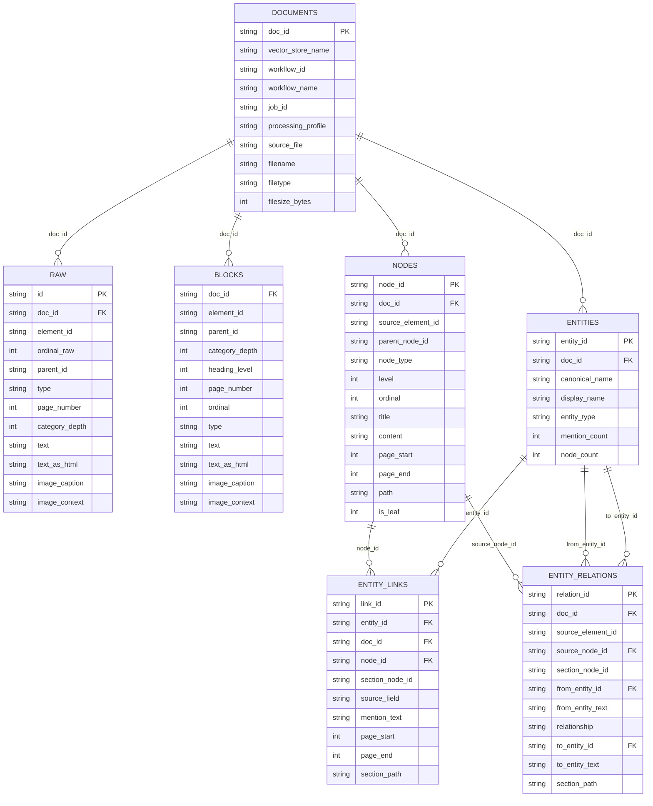
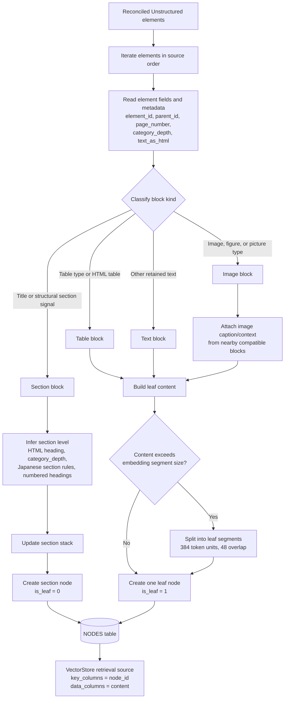
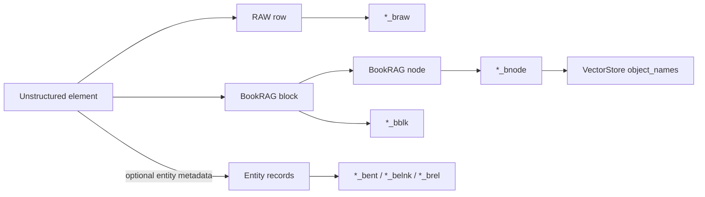

# BookRAG Pipeline: Data Structures and Processing Flow

This document describes the current `multi_format_bookrag` implementation in EVSUI. It focuses on the runtime data flow, persisted Teradata structures, and the node-tree construction algorithm used before VectorStore creation.

## 1. End-to-End Pipeline

```mermaid
flowchart LR
    DOC[Document files] --> MODE[Multi-Format BookRAG mode]
    MODE --> WF[Build Unstructured workflow definition]
    WF --> PART[Partitioner node<br/>auto / hi_res / vlm / fast]

    PART --> ENRICH{Optional enrichment nodes}
    ENRICH -->|Image Description| IMG_DESC[Image descriptions]
    ENRICH -->|Table to HTML| TABLE_HTML[Table HTML]
    ENRICH -->|Table Description| TABLE_DESC[Table descriptions]
    ENRICH -->|Generative OCR| GEN_OCR[OCR-enhanced text]
    ENRICH -->|NER| NER[Entity metadata]

    PART --> JOB[Unstructured on-demand job]
    IMG_DESC --> JOB
    TABLE_HTML --> JOB
    TABLE_DESC --> JOB
    GEN_OCR --> JOB
    NER --> JOB

    JOB --> RAW_JSON[Raw Unstructured output<br/>JSON elements]
    RAW_JSON --> RAW_STAGE[Raw stage file<br/>uploads/bookrag_raw_stage]
    RAW_STAGE --> RECON[Reconcile elements<br/>normalize parentage and metadata]

    RECON --> RAW_ROWS[Build raw rows]
    RECON --> BLOCKS[Build BookRAG blocks]
    BLOCKS --> NODES[Build document node tree]
    RECON --> ENTITY_GATE{Entity tables enabled?}
    ENTITY_GATE -->|Yes| GRAPH[Build entities, links, relations]
    ENTITY_GATE -->|No| SKIP_GRAPH[Skip entity graph]

    RAW_ROWS --> TD[(Teradata BookRAG tables)]
    BLOCKS --> TD
    NODES --> TD
    GRAPH --> TD

    TD --> VS[VectorStore source object<br/>*_bnode]
    VS --> RETRIEVAL[Retrieval over node content]
```



## 2. Persisted Data Model



## 3. Node-Tree Construction Algorithm



## 4. Runtime Object Flow



## 5. Table Naming Convention

For a vector store named `demo`, BookRAG table targets are generated from the `<vector_store_name>_bk` base name:

```text
demo_bk_bdoc   documents
demo_bk_braw   raw elements
demo_bk_bblk   normalized blocks
demo_bk_bnode  document tree nodes
demo_bk_bent   entities
demo_bk_belnk  entity mentions linked to nodes
demo_bk_brel   entity relations
```

The current BookRAG VectorStore source is the node table:

```text
object_names = <schema>.<vector_store_name>_bk_bnode
key_columns  = ["node_id"]
data_columns = ["content"]
```

Only nodes with retrievable `content` are useful for semantic retrieval. Section nodes preserve hierarchy and path context; leaf nodes carry the text, table, or image-derived content used by the VectorStore.
